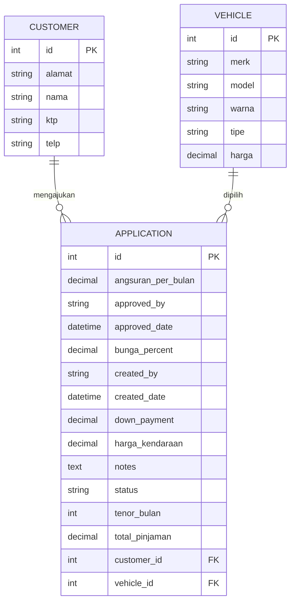

# 🚀 Loan Application System

### Spring Boot | JWT Security | MySQL | HTML/JS Frontend | Swagger API

Sistem pengajuan kredit kendaraan dengan autentikasi JWT, integrasi MySQL, UI HTML/JS, dan fitur auto-harga kendaraan berdasarkan pilihan dropdown.

---

# 🧱 Fitur Utama

### 🔐 Authentication (JWT)

- Login menghasilkan JWT token.
- Token digunakan untuk semua request backend.
- Role:
  - `ROLE_SALES` – membuat pengajuan kredit
  - `ROLE_APPROVER` – approval kredit (future upgrade)

### 🚗 Vehicle Auto-Price

- Dropdown kendaraan di-load dari backend (`/api/vehicles`)
- Ketika kendaraan dipilih → **harga muncul otomatis**

### 👤 Customer Master

- Data customer otomatis ditampilkan dari backend (`/api/customers`)

### 📝 Loan Application

- Form pengajuan kredit lengkap (customer, vehicle, tenor, harga otomatis, dp)
- Tersimpan ke MySQL

### 🖥️ Swagger API Docs

```
http://localhost:8080/swagger-ui/index.html
```

---

# 🏛️ Arsitektur Sistem (System Architecture Diagram)

```mermaid
flowchart LR
    A[Browser UI (HTML + JS)] -- JWT Login --> B[Spring Boot AuthController]
    A -- Fetch Customers --> C[CustomerController]
    A -- Fetch Vehicles --> D[VehicleController]
    A -- Submit Loan --> E[ApplicationController]

    B -- Generate Token --> A

    C --> F[(MySQL)]
    D --> F
    E --> F

    B --> G[JwtAuthFilter]
    C --> G
    D --> G
    E --> G

    G -- Validate Token --> B
```

---

# 🗃️ ERD (Entity Relationship Diagram)



---

# 🗂️ Struktur Project

```
loanapp/
 ├── src/main/java/com/example/loanapp
 │   ├── config/SecurityConfig.java
 │   ├── controller/
 │   │     ├── AuthController.java
 │   │     ├── CustomerController.java
 │   │     ├── VehicleController.java
 │   │     └── ApplicationController.java
 │   ├── entity/
 │   │     ├── Customer.java
 │   │     ├── Vehicle.java
 │   │     └── Application.java
 │   ├── repository/
 │   │     ├── CustomerRepository.java
 │   │     ├── VehicleRepository.java
 │   │     └── ApplicationRepository.java
 │   └── security/
 │         ├── JwtAuthFilter.java
 │         └── JwtUtil.java
 │
 ├── src/main/resources/
 │   ├── application.properties
 │   ├── data.sql
 │   └── static/index.html
 │
 └── pom.xml
```

---

# ⚙️ Requirement

- JDK 17+
- Maven 3.8+
- MySQL 8+
- (Optional) Docker

---

# 🐳 Jalankan MySQL via Docker

```
docker-compose up -d
```

MySQL:

```
host: localhost
port: 3306
db: loanapp
user: root
pass: root
```

---

# 🔧 Konfigurasi Database

`application.properties`:

```properties
spring.datasource.url=jdbc:mysql://localhost:3306/loanapp
spring.datasource.username=root
spring.datasource.password=root
spring.jpa.hibernate.ddl-auto=update
spring.jpa.show-sql=true
```

---

# 🚀 Build & Run

### 1. Build

```
mvn clean package
```

### 2. Run

```
mvn spring-boot:run
```

atau:

```
java -jar target/loan-app-0.0.1-SNAPSHOT.jar
```

---

# 🔑 Akun Default (data.sql)

### SALES

```
username: sales
password: password
```

### APPROVER

```
username: approver
password: password
```

---

# 🌐 URL Penting

| URL                                           | Fungsi           |
| --------------------------------------------- | ---------------- |
| `http://localhost:8080/`                      | UI utama         |
| `http://localhost:8080/swagger-ui/index.html` | Dokumentasi API  |
| `/api/auth/login`                             | Login JWT        |
| `/api/customers`                              | Master customer  |
| `/api/vehicles`                               | Master kendaraan |
| `/api/applications`                           | Pengajuan kredit |

---

# 🤖 Cara Kerja Auto Harga Kendaraan

1. Login → token disimpan ke `localStorage`
2. UI otomatis memanggil:
   - `/api/customers`
   - `/api/vehicles`
3. Saat kendaraan dipilih dari dropdown:

```js
hargaKendaraan.value = selectedVehicle.harga;
```

---

# 📈 Future Development (Optional)

- Upload KTP
- Approval berjenjang
- Hitung bunga (flat/efektif)
- Dashboard Admin
- React/Vue frontend
- Notifikasi WA/SMS
- dan lain sebagainya...

---

# 📄 Lisensi

Bebas digunakan untuk latihan, portfolio, dan tes coding.

---

# 🙌 Kontribusi

Pull request diterima!
